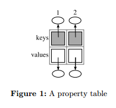
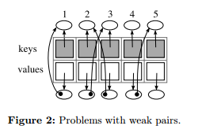

# 消除弱表中的循环（Eliminating Cycles in Weak Tables）

------

- 作者：Alexandra Barros, Roberto Ierusalimschy
- 译者：[重归混沌](http://blog.gotocoding.com)

## 摘要：

*弱引用* 为与垃圾回收器交互提供了一种优雅的机制。*弱引用* 的大多数典型应用都是通过*弱表*来实现的（例如:Java中的WeakHashMap）。 然而大多数*弱表*都有一个很苛刻的限制：只要*弱表*中key和value相互循环引用，那么即使已经没有外部数据对它们进行引用，这些数据也不会被垃圾因收器回收。这最终会为在某类应用中使用弱表带来困难。

在本文中，我们呈现了在lua编程语言中，是如何克服这个困难的。我们的方法包含了一个对表的ephemerons机制的变种。为了提供这种机制，我们修改了lua虚拟机的垃圾回收器。带着这个修改后的垃圾回收器，我们可以来这个解决弱表中的循环引用是实现是否高效和可用。

#### 关键字:垃圾回收，弱表，弱引用

#### 分类: D.3.3

## 1 介绍

带有自动内存管理的编程语言一般都会在*客户程序*和*垃圾回收器*提供一个接口. 这个接口一般都会允许客户程序与垃圾回收器进行交互，典型的代表是*finalizer(终结器)*[Atkins and Nackman 1988,
Boehm 2003, Dybvig et al. 1993, Hayes 1992]和*weak reference(弱引用)*[Leal 2005].

finalizer是一种特殊的方法，垃圾回收器在回收某个对象所占用的内存之前会自动调用finalizer函数。这样的方法被用在许多活动中，包括对象高速缓存的管理和释放由服务或其它程序提供的资源。 Finalizers有异步特性。Bloch[Bloch 2001] 说finalizer是不可预测的、高危的、不必要的，并且对程序的效率是有负作用的。然而，Boehm[Boehm 2003]认为finalizer是必要的，并且它的异步性并不一定会导致不健全的过程。

弱引用是一种不会阻止垃圾回收器回收对象的引用。许多有垃圾回收的编程语言至少从80年代起就提出了支持弱引用[PARC 1985, Rees et al. 1984]. 在一些其它的应用中，弱引用可以被用来实现finalization机制， 与传统的finalizers相结合可以避免很多问题。根据编程语言和垃圾收集管理器的实现方式的不同，对finalizer的支持甚至都变得不是必要的。

弱引用越来越重要，促使我们寻找一个关键的问题的解决方案：在弱表中循环。一个典型的例子，这个问题与*属性表*一起出现。通常，我们想动态的向一个对象增加一些属性，但是又不想修改它的类(class).一个常见的做法是使用*属性表* 。 在属性表中，一个对象的引用被插入作为搜索key(索引key）,而与该key相关联的值被用来指定这个额外属性的值。 然而，如果表中所有引用都是平凡的，一个简单插入新的*key/value对* 的操作都将会阻碍被key所引用的对象被回收。 解决这个问题最好的办法就是通过弱引用实现的*弱表* 。一个弱表由多个*weak pair(键/值对)* 组成， weak pair的第一个元素为key(键)是一个弱引用，weak pair的第二个元素为value(值）是一个平凡引用。在这种方式下，增加一个属性到一个对象中去，并不会阻止垃圾回收器对这个对象的回收。

然而，在在弱表中循环依然会发生在大部分编程语言中：由于key和value循环引用的存在，会导致这些循环引用的key和value即使客户程序已经对这些循环的key和value没有任何引用的情况下，也不能被很好的回收。这些循环的一个常见的场景包括一个value引用了与它相关联的key。例如：一个属性表(被实现为弱表)可能将函数和它们各自的模块相关联，以便它可以说明给定函数属于哪个模块。每个模块又会引用它们自己模块内的函数，因此在这个属性表中将不会有任何key和value被回收掉。这最终导致对内存的巨大浪费并且会增加使用弱表的负担。这个问题已经被发现，例如，在编程语言像Java[SUN 2006] 和 Lua[Ierusalimschy 2006]中. 通过Lua的讨论列表，我们可以发现这个问题被抱怨的频率。

这个问题可以通过一种叫做*emphemerons*的机制来解决，这个机制被Hayes[Hayes 1997]提出。 Jones[Jones et al. 1999]为Haskell[Glasgow 2007]编程语言独立实现了一个类似的解决方案，这个方案与ephemerons机制有相同的核心思想。

鉴于其在Haskell上的成功，我们为Lua设计并实现了这种机制的一个变种。作为一个起点，我们认真的学习了一个Kayes[Kayes 1997]描述的算法。在我们学习的过程中，我们很好奇它为什么没有被大多数语言所实现，实现它所带的来影响是什么。最后，我们实现了一个Lua垃圾回收器的变种以便我们可以评测这种影响。 我们的目的是为了展示，通过为lua引入ephemerons可以很容易的解决循环在弱表中产生的问题。 并且通过这么做我们可以改善弱引用机制。

## 2 弱表

弱表是包含一个或多个*weak pair*的数据结构。 这一个weak pair中， 第一个元素（key） 被弱引用保留，第二个元素（value）被平凡引用保留。在Java编程语言中，弱表是类**WeakHashMap**来通过弱引用实现的。 在Lua中，弱表是一个原始机制（它可以在需要的时侯，被用来实现常归弱引用）。然而，在Lua中，我们不仅可以构造包含weak pairs的弱表，还可以构造强key和弱value，或者弱key和弱value的弱表。

在Lua中，每个table都有一个metatable(元表), 这个metatable用来控制table的一些行为。metatable中的每个字段都会控制table的特定功能。而字段**__mode**是一个字符串类型用于控制table的弱引用。如果字符串包含字符'k', 则所有key都是弱引用；如果它包含字符'v', 那么所有的value都是弱引用的；如果字符串同时包含'k'和'v', 那么key和value均为弱引用。 Code 1展示了怎么样创建一个包含weak pairs的弱表。

>**Code 1** Creating a weak table in Lua.

	a = {} -- a regular table
	b = {} -- it's metatable
	setmetatable(a, b)
	b.__mode = "k" --makes 'a' weak

大部分弱引用的典型应用都涉及弱表。对于弱引用（和弱表）最相关的应用程序，我们强调如下：

- **循环数据结构的回收** -单纯的引用计数垃圾回收器是不能够回收循环应用的数据结构的。 根据Brownbridge[Brownbridge 1985], 这个缺点是开发弱引用的最初动机。 只要将一个环中的至少一个平凡引用替换为弱引用，问题就很容易被克服了。随着跟踪垃圾收集器的到来，这个用法逐渐被废弃。

- **Cache** -对于一些频繁使用大数据结构的应用程序来讲，把这些数据结构常驻在内存中可以显著提高程序的效率。但是，这可能会加速内存消耗。弱表提供了一个简单的方案来实现一个自动管理的缓存，它可以只在内存足够的情况下才保留数据。
   
   根据literature[Ierusalimschy 2006, Jones et al. 1999], 一个常见使用cache的应用就是*memoized function（[记忆函数](https://en.wikipedia.org/wiki/Memoization)）* 。通过存储结果，可以使一个复杂的函数中必要的计算开销显著减少。当函数被重新以相同的参数调用时，它仅仅返回之前存储过的结果即可。在一个长期运行的应用中，*memoized function*所占用的内存可能增长到一个令人无法忍受的地步。在这种情况下，使用弱表(weak table)可以透明的只保存最近（也可能是最频繁）访问的值而不用牺牲内存的可用性。
  
- **Weak sets** -弱集合可以理解为一个对象的集合，这些对象与这个集合进行关联，但并不会产生一个到对象的引用。在对象必须被成组处理，却又不必干涉其生命周期的情况下，弱集合常被用作一个解决方案的实现。一个常见的例子是设计模式中的*观察者* 模式， 这种模式定义了一种在对象之间一对多的从属关系，当一个对象改变状态之后，它的所有从属都会被自动通知和更新[Ganna et al. 1995]. 此通知可以实现的关键在于需要让被观察的对象知道它有哪些观察者。在一个松耦合的应用程序中， 这些对观察者的引用不应该也不能阻止它们被回收。使用弱表来保存观察者对像并不会阻止它们被回收。

- **Finalization** -弱引用可以被当作一个通知的扩展形式用来通知客户程序对象已经被回收了，最终执行与这些事件相关联的例程（函数）。这被称作集装箱销毁，与类实例销毁形成对比，类实例销毁是采用面向对象实现的[Hayes 1997, Jones et al. 1999]。

- **Property tables** -弱表可以让我们对一个对像增加任意属性，即它们可以表现为属性表。使用弱表来实现属性表所带来的益处依赖于一个事实，在大部分情况下，增加一个属性到一个对象并不需要改变对象的生命周期。例如，考虑 Figure 1. 在这个表中，每一个key都有一个对象的弱引用，每一个key所对应的value都有一个对这个对象的额外属性的平凡引用。如果key对对象的引用是平凡的，只要简单的插入一个新的key/value对就会阻止被key所引用的对象被回收。只有当key对对象的引用为弱引用时，对象才可以在不被客户程序使用时尽快回收。

理论上，只有弱表中的key/value pairs中的key可以从弱表外的某个地方*直接或间接可达* ，这个key/value pair才必然会存在于弱表中。（如果key被一些外部对象引用它就是*直接可达* ，如果key被另一个key/value对中的value所引用，而这个value所对应的key是直接或间接可达的，那么这个key就是*间接可达* .）然而在大多数编程语言的实现中，并不存在这一行为。当一个key/value对中的value字段直接或间接的引用了它的key, 就会在表内或不同的弱表之间的两个元素中形成环。Figure2 上描述的table展示了这个问题。 由于元素1的自引用（value引用key）和元素2，3之间环的存在，所有被这些对象（译者注：指的是元素1，2,3）引用的元素将永远不会被回收。即使没有环的存在，回收这些对象所经过的时间也将远超预期。考虑元素4和5，元素4的value有一个对元素5的key的引用。一般来说，只有当元素4被回收之后的循环中元素5才可以被回收。一个有n个元素组成的链的弱表完全被回收将会花费n个循环。有人可能认为如要把value从强引用改为弱引用将会对这个问题有帮助，遗憾的是，这是不正确的。考虑一个属性表，一个对象作为vaule只存在于这个表中。如果value对对象的引用是弱引用，这意味着这个对象将会被回收。但是，这个对象对应的key可能还依然处于活动中，依然有可能会用这个key在属性表中搜索其对应的value(对象)。

例如，当弱表被*memoized functions*（记忆函数）用做缓存时也可能存在环。假如我们想创建一些常数函数：给一个值，创建一个函数，这个函数总是返回这个值。使用Lua语言的一个实现可能是这样：

>    
	function K(x)
		return function() return x end
	end

如果我们想记忆这个函数（以便对于最近处理过的值，我们可以不必重复创建这个函数），我们需要一个表来映射从x(key)到K(x)(value)。注意，value是一个函数，这个函数包含了x的引用。这样，key和value永远都不会被释放。

像Java和Lua都面临着弱表循环的问题。Java的**WeakHashMap** API有一份实现说明，“需要注意保证value对象不能直接或间接的强引用它们的key，以便它不会阻止key被丢弃”[SUN 2006]。

## 3 Ephemeron

对弱表循环问题一个有意思的解决方案，这个方案第一次被Hayes[Hayes 1997]提出，那就是使用*ephemerons*来代替weak pairs。Ephemerons是对weak pair的细化，Ephemerons的key和value都不是传统的弱或强。key的连通性，决定了value的连通性，但是value的连通性并不影响key的连通性。根据Hayes, 如果垃圾回收器想要提供ephemerons的支持，就必须从两阶段（标记和清除）改为三阶段。我们考虑一下新的第一阶段和第二队段，因为它们是我们工作是最相关的。第三阶段的详细内容可以从Kayes[Kayes 1997]查找。

第一阶段，根据对象的引用关系，跟踪整个引用图上的所有对象。当发现一个ephemeron后，垃圾回收器并不会去跟踪ephemeron的成员，回收器把ephemeron放入一个待处理队列中。这时ephemeron可能包含可达的条目(key/value pair)，也可能不包含。

第二阶段，垃圾回收器扫描ephemeron队列。只有当ephemeron中的key已经标记为可达，才跟踪相应的value，因为如果key是可达的，那么程序中的其它部分可能就需要访问它的value. 当ephemeron中的key已经不可达时，不管它是否包含了可达的value, 这些ephemeron都将存在于队列中以便以后观察。现在我们有了两组ephemeron, 一组含有可达的key,一组包含有不可达key。第一组会采用与non-ephemeron一样的方法(即常归方法)去跟踪。由于key是可达的，并且已经跟踪过了， 因此只需要跟踪value即可。但是，value可能会引用还在队列中的一些ephemerons中的key, 这可能导致这些key可达。当这种情况发生时，队列需要重新检查。除此之外，可能会出现额外的ephemerons。这种情况下，它们会被塞入队列。

这个步骤会一直执行到队列中的ephemerons中的key都不可达为止。当队列收敛成这样一个集合时，垃圾回收器就可以回收这些epphemerons所占用的内存了。第二阶段算法的伪码如Code2 所示：

>  **Code2** Second phase of the ephemeron's collection alogrithm

	1:	while TRUE do
	2:		for all e ∈ ephemeron-queue do
	3: 			if key(e) is marked then
	4: 				put(reachable-value, e)
	5: 			else
	6: 				put(unreachable-value, e)
	7: 			end if
	8: 		end for
	9: 		ephemeron-queue ⇐ unreachable-value
	10: 	if reachable-value is not empty then
	11:	 		for all e ∈ reachable-value do
	12: 			trace(value(e))
	13: 		end for
	14: 		make-empty(reachable-value)
	15: 	else
	16: 		return
	17: 	end if
	18: end while

Haskell编程语言为key/value pairs中的弱引用定义了一套类似的语义。我们的工作表明是可以很容易将ephemerons机制并入到当前的Lua编程语言的实现中的。只需要修改垃圾回收算法的一小部分就可以做到。下一节将描述我们怎么实现ephemerons机制并测量它的效率和有效性。

## 4 消除循环

正如我们在第2节所看到的那个，大多数弱引用的使用都离不开弱表。但是循环问题为弱表的使用造成的一大障碍，它可会丢失内存或造成内存延迟回收。尽管在编程社区并不众所周知，但ephemerons机制确实是这个问题非常合理的解决方案。因此我们决定修改Lua的垃圾回收器来提供ephemeron的支持，并评测这种改动所带来的影响。

基本上，一个ephemeron由一个key/value pair组成；这些pairs并不一定要存储在表中。然而由于我们总是在面临弱表循环时才需要ephemerons, 因此考虑*ephemerons tables* 而不是单独的key/value pairs是合理的。Ehpemerons表是在Lua中实现ephemerons的最佳方式，因为表是Lua中的主要数据结构，还因为Lua是通过弱表来支持弱引用的。在我们的方案中，一个含有弱key和强value的弱表即是一个ephemerons表。我们仅仅修改了一下垃圾回收器的算法，而不是创建了一种新类型的表。这意味着，在新的实现中，创建一个ephemerons表，你仅仅需要像往常一样创建一个弱key强value的弱表就可以了。第5节会展示这种弱表在旧的实现和新的实现中的效率评测，这种弱表在新的实现中被称做ehpemerons表。

现在让我们来看一下它是如何工作的。Code 3 展示了在表**et**中创建了一个简单的循环，et是一个ephemerons表。在这个循环中第一个条目(entry)的value指向第二个条目的key。如果弱表中的弱key被外部使用的话，那这个循环永远不会被回收。创建完循环，显式的调用垃圾回收函数。因为我们使用了ephemerons表，这个循环将会被回收，在执行的末尾，变量**count**的值为0。

> **Code3** Example of how an ephemerons table works

	et = {}
	mt = {}
	setmetatable(et, mt)
	-- sets the table to be an ephemerons table
	-- in the new implementation.
	mt.__mode == "k"
	a = {}
	b = {}
	et[a] = b
	et[b] = a
	a = nil
	b = nil
	collectgarbage()
	counte = 0
	for k, v in pairs(et) do
		count = count + 1
	end
	print(count) -- 0

### 4.1 实现

在讨论实现以前，我们花一些时间来描述一下Lua的垃圾回收。

Lua的垃圾回收算法是*三色标记*增量算法[Dijkstra et al. 1978]。这个算法在监测到（非）垃圾时，会将*跟踪*阶段与程序运行交替执行。在三色标记算法中，回收器可以被描述为一个过程，这个过程跟踪对象并为它们着色。在开始，所有的对象都是白色。当回收器跟踪引用图时，它会给每个它经过的对象着为黑色。在回收的末尾，所有可以被访问的对象一定是黑色，并且所有白色对象将会被删除。但是，由于垃圾回收器与程序是交替运行的，因此我们需要考虑中间状态。此外，程序不允许改变引用图，否则回收器将不能找到所有可达对象。为了解决这一问题，三色标记算法使用了第三种颜色中的灰色来表示，对象可达但是它们的子节点还没有被跟踪。这意味着，当一个对象正在被跟踪过程中(tracing),它就会被着为灰色。当所有的子节点都被跟踪后，这个对象将会被着为黑色。直观上，跟踪中(tracing)就像是掀起了一个灰色对象的波浪，把白色（不可达）对象和黑色对象分开了，前提是，黑色对象永远不会引用白色对象。然而程序可能仍然会从黑色对象上创建一个指向白色对象的指针，这违反了那个前提。为了防止这种情况，回收器使用*write barrier* :当程序试图将一个白色对象的引用写入黑色对象中，不管原来是黑色还是白色，都将会变成灰色。

Lua垃圾回收分为4个阶段。第一个阶段，回收器跟踪并为所有对象着色。这个阶段与应用程序交替执行。第二阶段被称作原子阶段，当几个操作为单步执行时，一些垃圾回收操作不可以与程序的执行交替（比如清除弱表）。在第三阶段，依然是增量的，回收器将会释放被白对象占用的内存。最后，第四阶段，finalizer与程序运行交替执行。为了简化对垃圾回收器行为的理解，我们将考虑讨论过的其中两个阶段：一个原子阶段即为之前的第二阶段，一个非原子阶段，即为之前的第一、三、四阶段。

在ehpemerons回收算法中，垃圾回收器首先跟踪对象图。当找到一个ephemeron时，不是直接去跟踪其子节点，而是将ephemeron插入到一个队列中，以便以后处理，然后继续跟踪阶段。对我们而言，我们需要一个数据结构来表示ephemerons表的队列。Lua垃圾回收器最初的实现是有一个单独的数据结构来存储三种弱表，这个数据结构就是**weak**链表。在我们实现的垃圾回收器中，这个链表被分开为三个链表，每一个链表只管理一种弱表。ehpemeron链表只管理只有弱key的弱表，也预示着所有这种类型的表是一个ephemeron表。这样，在跟踪阶段，当垃圾回收器发现一个ephemerons表就会将它插入到**ephemeron**表中去。

为了实现ephemerons机制，我们在垃圾回收器阶段中增加了一个新的操作。首先，就像之前描述的那样，当一个ephemerons表被发现时，就将其放入**ephemeron**。ephemerons表中的条目不管是key还是value都不会被跟踪。（注意，在原先的机制中，每一个key/value pair都代表着一个ephemeron。）这就是第一阶段增加的内容。

然后，当几个操作以单步的方式执行过后，垃圾回收器进入原子阶段。我们为这个阶段实现了两个新的函数:**traverseephemeron**， 此函数用来跟踪**ephemeron**链表, 和**covergeephemerons**，此函数调用第一个函数来收敛链表**ephemeron**。这些函数的伪码参见Code4。函数**traverephemeron** 会跟踪一个ephemerons表的所有条目。如果有条目(entry)的key被标记，意味着它是可达的，对应的value也需要被标记。函数**traverseephemeton** 返回一个bool值，被Code4中的变量了所代替。这个bool值为true代表有ephemerons表已经被标记，否则返回false.

函数**covergeephemeron**调用**traverseephemeron**。当这个函数返回为true时，即，有value被标记，前者会调用垃圾回收器最初实现的一个函数**propagateall**。这个函数是没有修改过的。它任务就是跟踪程序的引用图，根据三色标记算法，来展开灰色key的屏障。注意，在之前**traverseephemeron**的执行过程中，ehpemerons表中的value将会被标记。因此，**propagateall**将会标记被这些value直接或间接所引用的对象。由于新标记的对象可能引用ephemerons表，函数**covergeephemerons**需要重复调用**traverseephemeron**。当没有value被标记时，**traverseephemeron**将会返回false。如果在跟踪完所有的ephemeron表之后，没有value被标记，**covergeephemerons**函数会停止执行。函数**covergeephemerons**和**traverseephemeron**修改了Lua垃圾回收器第二阶段原本的实现。

在**covergeephemerons**函数执行完之后，依然停留在原子阶段，回收器就像调用**propagrateall**一样去调用**cleartable**函数，这个函数属于回收器原本的实现。函数**cleartable**删除掉弱表中不可达的条目，包括像ephemeron表那样包含弱key和强value的弱表。最后，回收器进入它最后的阶段，在这个阶段它释放内存并执行finalizer。这个阶段没有任何修改。

> Code 4 Pseudo-code for covergeephemerons and traverseephemeron

	function convergeephemerons(ephemeron)
	1:	while TRUE do
	2: 		changed ⇐ FALSE
	3: 		for all e ∈ ephemeron do
	4: 			if traverseephemeron(e) then
	5: 				changed ⇐ TRUE
	6: 				propagateall(...)
	7: 			end if
	8: 		end for
	9: 		if not changed then
	10: 		break
	11: 	end if
	12: end while

	function traverseephemeron(e)
	1: 	b ⇐ FALSE
	2: 	for all pair ∈ hash(e) do
	3: 		if key(pair) is marked then
	4: 			mark the value
	5: 			b ⇐ TRUE
	6: 		end if
	7: 	end for
	8: 	return b
	
